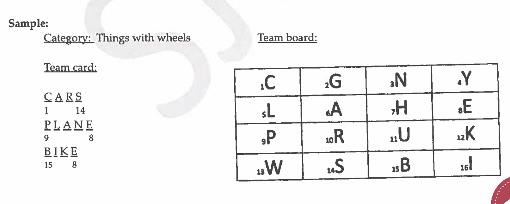

So I have an event for Elementary Science Olympiad that requires students to find between 3-9 science words in a 4x4 grid of letters.  The words need to start with one letter anywhere on the grid and each successive letter in the word has to touch the previous square on any side or corner.  No letter square can be used more than once in a single word.

I gave you a list of words, you could write an app or script that could make the grids for them to practice with?  Or, better yet an app we could use indefinitely with user inputted words?

